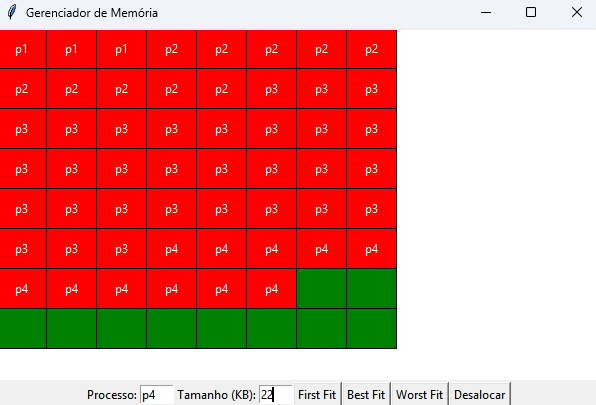

# Memory Manager – Python Simulator



## Description

This project is a **memory management simulator** built in Python that divides memory into fixed-size blocks and allows process allocation and deallocation using the **First Fit, Best Fit, and Worst Fit algorithms**.
The graphical interface (GUI) was implemented using **Tkinter**, visually displaying memory along with occupied and free blocks.

---

## Features

* **Fixed-size memory block division**

  * Total memory: 128 KB
  * Each block size: 2 KB
  * Each process occupies full blocks, even if the requested size is smaller than the block.

* **Process allocation**

  * Supported algorithms:

    * **First Fit**: allocates in the first continuous free space large enough for the process
    * **Best Fit**: allocates in the smallest continuous free space that can fit the process
    * **Worst Fit**: allocates in the largest available continuous free space

* **Process deallocation**

  * Any process can be manually deallocated through the code.

* **GUI Visualization (Tkinter)**

  * Free blocks appear in **green**
  * Occupied blocks appear in **random colors**
  * Each continuous process keeps its **fixed color** while allocated

* **Textual display**

  * The `display()` function prints the current state of memory in the terminal, showing which blocks are free and which are occupied.

---

## Project Structure

```bash
memory-manager/
│
├── block.py           # Block class representing each memory block
├── memoryManager.py   # MemoryManager class with allocation/deallocation logic
├── gui.py             # Tkinter graphical interface
└── main.py            # Main script to test the simulator
```

---

## How to Use

1. Clone the project:

```bash
git clone https://github.com/Yuri-Diego/memory-manager.git
cd memory-manager
```

2. Run the simulator using Python 3.13 or higher:

```bash
python main.py
```

3. The GUI will open displaying the memory:

   * Green blocks → free
   * Colored blocks → occupied by processes

---

## Notes

* **Partial allocation**: each process occupies full blocks; if the process does not completely fill a block, the remaining space in that block cannot be used by another process.
* **Automatic deallocation** has not been implemented yet. Currently, processes must be manually deallocated using `deallocate(process)`.

---

## Dependencies

* Python 3.13 or higher
* Tkinter (usually included with standard Python installation)

---

## Future Improvements

* Implement **automatic deallocation** when there is not enough available space.
* Add GUI buttons to **allocate and deallocate processes manually**.
* Improve visualization by showing process names centered inside larger blocks.
